Attention to Bert
=====
-----
### 1. Attention mechanism
#### 1-1 Attention의 아이디어  
디코더에서 출력 단어를 예측하는 매 시점마다, 인코더에서의 전체 입력 문장을 다시 한번 참고. 전체 입력 문장 전부 다 동일 비율로 참고하는 것이 
아닌, 해당 시점에서 예측해야 할 단어와 연관이 있는 입력 단어 부분을 좀 더 집중(Attention).

#### 1-2 Attention Function  
#####**Attention(Q, K, V) = Attention Value**

어텐션 함수는 주어진 'Query' 에 대해 모든 'Key' 와의 유사도를 각각 구함. 구해낸 유사도를 키와 매핑되어 있는 각각의 'Value' 에 반영해줌.
유사도가 반영된 'Value' 를 모두 더해 리턴. 이 리턴되는 값이 Attention Value. 
```
Q = Query : t 시점의 디코더 셀에서의 은닉 상태
K = Keys : 모든 시점의 인코더 셀의 은닉 상태들
V = Values : 모든 시점의 인코더 셀의 은닉 상태들
```

#### 1-3 Attention Mechanism
<그림 1>
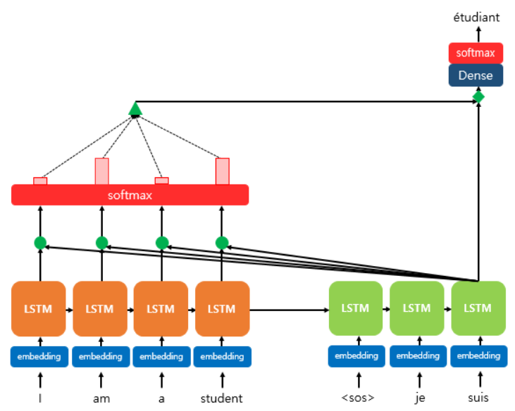  
softmax 함수 주목.  I, am, a, student 단어 각각이 출력 단어를 예측할 때 얼마나 도움이 되는지의 정도를 수치화한 값. 이 값들을 하나의 정보로
취합하여 디코더로 전송됨. 그림 1에서는 초록색 삼각형.

* Attention Score 도출  
<그림 2>
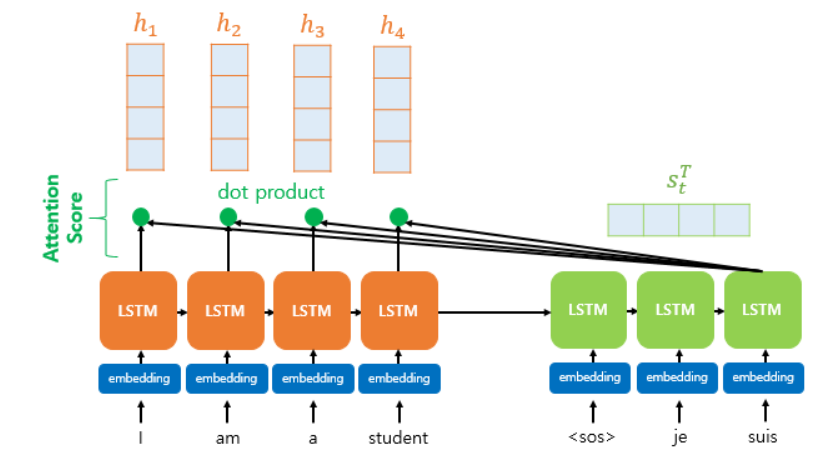
  
인코더의 시점(time step)을 각각 1, 2, 3, ... N이라 하였을 때, 인코더의 은닉상태(hidden state)를 각각 h1, h2, ... hn이라고 설정. 
디코더의 현재 시점 t 에서의 디코더의 은닉상태를 st라고 설정. 그림2 의 예에서는 인코더와 디코더의 차원은 4로 동일하다고 가정.  

시점 t에서의 출력 단어를 예측하기 위해 디코더의 셀은 두 개의 입력값을 필요로 함. 바로 이전 시점인 t-1의 은닉 상태와 출력 단어. 추가로 
attention value 값도 필요. t 번째 단어를 예측하기 위한 attention value를 at로 정의.
  
attention value를 구하기 위해선 먼저 attention score값이 필요. attention score란 디코더의 시점 t에서 단어를 예측하기 위해, 인코더의 
모든 은닉 상태 각각이 디코더의 현 시점의 은닉 상태 st와 얼마나 유사한지를 판단하는 스코어.  
  
dot-product attention(여러가지 어텐션 방식이 존재)에서는 이 스코어 값을 구하기 위해 st를 전치하고 각 은닉상태와 내적을 수행(그림 3).

<그림 3>  
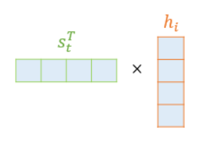

score(st, hi) = sTihi  
st와 인코더의 모든 은닉 상태의 어텐션 스코어 모음값을 et라고 정의.  
et = [sTthi, ..., sTthN]  
->
bt = softmax(et)  

* 각 인코더의 attention 가중치와 은닉 상태를 가중합하여 attention value를 구함  
<그림 4>
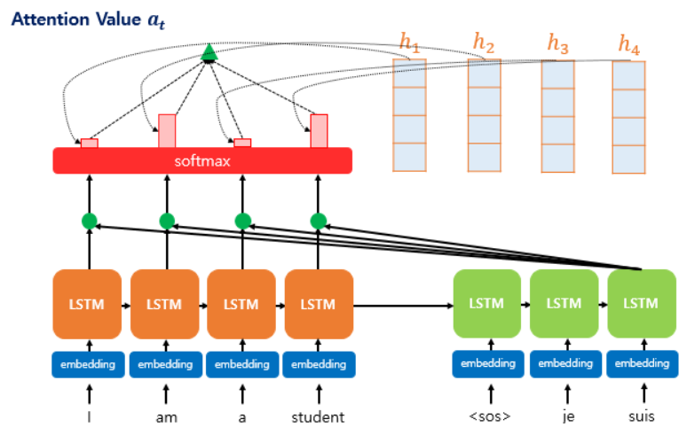  
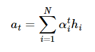  
attention value at는 종종 인코더의 문맥을 포함하고 있다고 하여 context vector 라고도 불림.  

* attention value와 디코더의 t 시점의 은닉 상태를 연결(concatenate)  
<그림 5>  
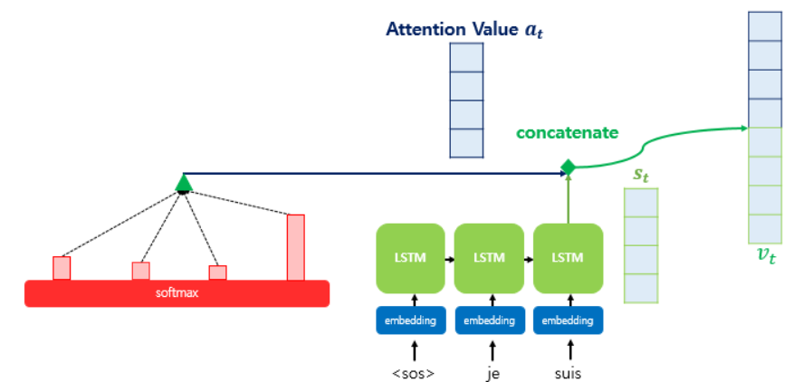  
st와 attention value를 concat 하여 vt로 만듦. 이 vt는 yhat 예측 연산의 입력으로 사용됨.  

### 2. Transformer  
```
dmodel = 512
인코더와 디코더에서 정해진 입력과 출력의 크기. 층 사이에서 이동할 때에도 이 크기를 유지함  

num_layer = 6
인코더와 디코더가 총 몇층으로 구성되었는지 의미. 논문에서는 6(인코더 6, 디코더 6)

num_head = 8
트랜스포머는 병렬로 어텐션을 수행하고 결과값을 다시 하나로 합치는데, 이 때 이 병렬의 개수

dff = 2048
트랜스포머 내부에는 피드포워드 신경망이 존재하는데 해당 신경망의 은닉층의 크기. 입력과 출력층은 512. 
```
<그림 6>  
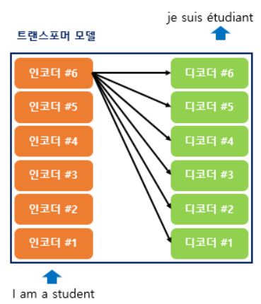
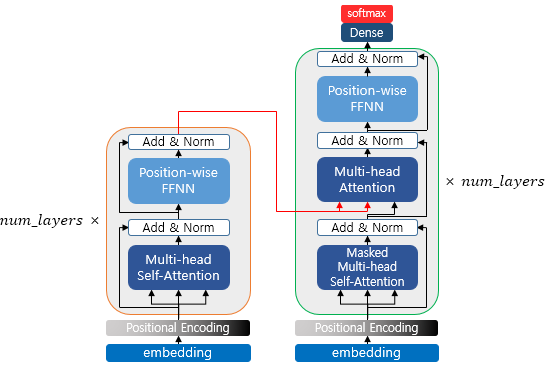
인코더와 디코더가 6개씩 존재하는 트랜스포머의 구조.    

<그림 7>  
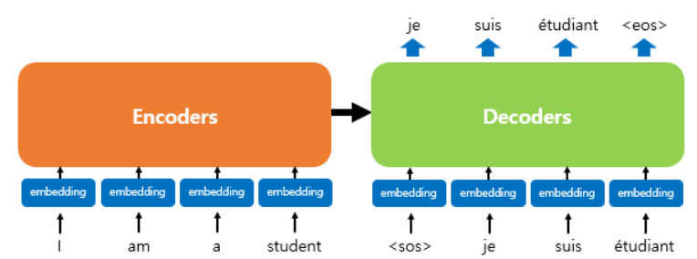  

#### 2-1 Positional encoding
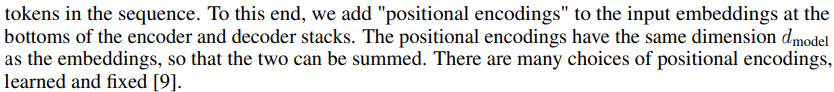
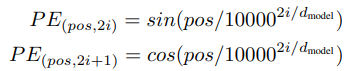  
<그림 8>  
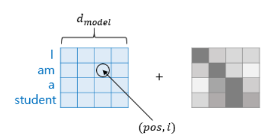  
pos 는 입력 문장에서의 임베딩 벡터의 위치를 나타내며, i는 임베딩 벡터 내의 차원의 인덱스를 의미.  
짝수(2i) -> 사인함수  
홀수(2i+1) -> 코사인함수  
positional encoding 값을 더해 주면, 문장 내 같은 단어라도 임베딩 벡터 값이 다르게 됨.  

#### 2-2 Attention
Transformer 에는 세 가지 종류의 attention이 사용됨. encoder self-attention, masked decoder self-attention,
 encoder-decoder attention. 첫 번째는 인코더층에서, 두번째와 세번째는 디코더층에서 사용.  

* self-attention  
<그림 9>  
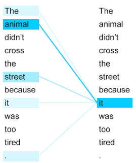   
self-attention이라 함은 query, key, value가 동일한 경우를 의미함. 여기서 동일이란 벡터의 값이 같은 것이 아닌, 
벡터의 출처가 같다는 의미.
```
Q = Query : 입력 문장의 모든 단어 벡터들
K = Keys : 입력 문장의 모든 단어 벡터들
V = Values : 입력 문장의 모든 단어 벡터들
```
* Q, K, V 벡터 얻기  
self-attention은 인코더의 초기 입력인 d-model의 차원을 가지는 단어 벡터들을 사용한 것이 아닌 각 단어 벡터들로부터
Q, K, V 벡터를 얻음. 이 Q, K, V 벡터들은 dk(dmodel/num_head, 둘 다 하이퍼파라미터. 논문에서는 각각 512, 8)만큼의 차원을 가지며, 
이는 같은 단어 벡터에 서로 다른 가중치 행렬(Wq, Wk, Wv)을 선형결합함으로서 얻을 수 있다.  
이 벡터들을 이용하여 attention을 병렬(num_head)로 진행한 후 모든 attention head들을 연결하여 가중치 행렬 W0를 곱한다.
여기서의 결과가 self-attention의 최종 결과물이 된다.

#### 2-3 Position-wise FFNN
2개의 hidden layer를 가지고 있는 네트워크. position 마다 즉, 개별 단어마다 적용했기 때문에 position-wise.


### 3. BERT  
<그림 10>  
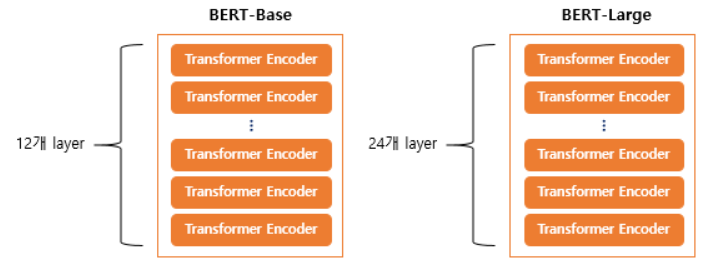
BERT(Bidirectional Encoder Representations from Transformers)
```
BERT-Base : L=12, D=768, A=12 : 110M params
BERT-Large : L=24, D=1024, A=16 : 340M params
```

#### 3-1 BERT's Embedding
* Position Embedding  
<그림 11>  
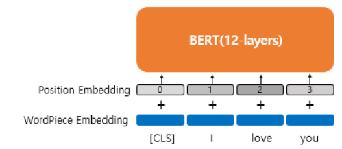  
기존 transformer와는 다르게 position embedding에 sin, cos 함수를 사용하지 않고 학습을 통해서 얻는 position embedding 사용. 
position embedding 벡터들을 기존 단어 임베딩 벡터들에 각각 더해주는 것은 동일.
  

* Segement Embedding  
<그림 12>  
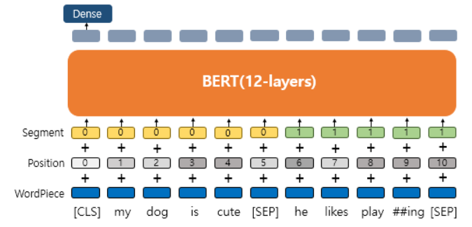  
  BERT에서는 임베딩 단계에서 하나의 층이 추가됨. 문장 구분을 위한 segment embedding. BERT를 활용한 감성 분류 태스크에서는 문장 분류가 
  필요하지 않아 fine-tuning 단계에서 Sentence 0 임베딩만을 더해주기도 함. 
  
#### 3-2 BERT's pre-training
<그림 13>  
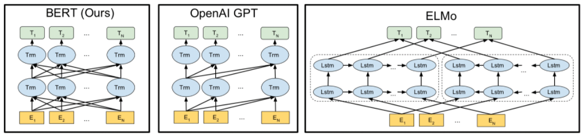  
  ```
  BERT: 양방향
  OpenAI GPT: 단방향
  ELMo: 양방향  
  ```
BERT 의 pretraining은 크게 두 가지로 나뉨. 마스크드 언어 모델, 다음 문장 예측

* Masked LM  
입력 텍스트의 15%의 단어를 랜덤으로 마스킹한([MASK] 토큰으로 변경) 후 이 가려진 단어들(masked words)을 예측하도록 함. 마스킹된 모든 
  단어들을 [MASK]토큰으로 변경하는 것이 아닌 80%만 토큰변경을 실시하고 10%는 다른 단어로 변경, 10%는 동일하게 두게 됨. [MASK] 토큰만
  사용할 시 파인튜닝 단계에서는 이 토큰이 없기 때문에 문제가 발생할 수 있기 때문.  
    
  <그림 14>  
  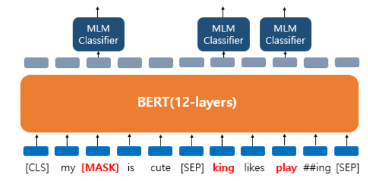  
  입력 문장은 'my dog is cut. he likes playing'.  
  >dog -> [MASK]  
  he -> king  
  play -> 유지  
  

* Next Sentence Prediction(NSP, 다음 문장 예측)  
BERT는 두 개의 문장을 준 후에 이 문장이 이어지는 문장인지 아닌지를 맞추는 방식으로 훈련시킴. 50:50 비율로 실제 이어지는 두 개의 문장과 
  랜덤으로 이어붙인 두 개의 문장을 주고 훈련시킴.
  > * 이어지는 문장의 경우  
    Sentence A : The man went to the store.  
    Sentence B : He bought a gallon of milk.  
    Label = IsNextSentence  
  
  > * 이어지는 문장이 아닌 경우  
    Sentence A : The man went to the store.  
    Sentence B : dogs are so cute.  
    Label = NotNextSentence  
  


