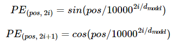

BERT
=====
Attention to Bert
-----
### 1. Attention mechanism
#### 1-1 Attention의 아이디어  
디코더에서 출력 단어를 예측하는 매 시점마다, 인코더에서의 전체 입력 문장을 다시 한번 참고. 전체 입력 문장 전부 다 동일 비율로 참고하는 것이 
아닌, 해당 시점에서 예측해야 할 단어와 연관이 있는 입력 단어 부분을 좀 더 집중(Attention).

#### 1-2 Attention Function  
#####**Attention(Q, K, V) = Attention Value**

어텐션 함수는 주어진 'Query' 에 대해 모든 'Key' 와의 유사도를 각각 구함. 구해낸 유사도를 키와 매핑되어 있느 각각의 'Value' 에 반영해줌.
유사도가 반영된 'Value' 를 모두 더해 리턴. 이 리턴되는 값이 Attention Value. 
```
Q = Query : t 시점의 디코더 셀에서의 은닉 상태
K = Keys : 모든 시점의 인코더 셀의 은닉 상태들
V = Values : 모든 시점의 인코더 셀의 은닉 상태들
```

#### 1-3 Attention Mechanism
<그림 1>
  
softmax 함수 주목.  I, am, a, student 단어 각각이 출력 단어를 예측할 때 얼마나 도움이 되는지의 정도를 수치화한 값. 이 값들을 하나의 정보로
취합하여 디코더로 전송됨. 그림 1에서는 초록색 삼각형.

* Attention Score 도출  
<그림 2>

  
인코더의 시점(time step)을 각각 1, 2, 3, ... N이라 하였을 때, 인코더의 은닉상태(hidden state)를 각각 h1, h2, ... hn이라고 설정. 
디코더의 현재 시점 t 에서의 디코더의 은닉상태를 st라고 설정. 그림2 의 예에서는 인코더와 디코더의 차원은 4로 동일하다고 가정.  

시점 t에서의 출력 단어를 예측하기 위해 디코더의 셀은 두 개의 입력값을 필요로 함. 바로 이전 시점인 t-1의 은닉 상태와 출력 단어. 추가로 
attention value 값도 필요. t 번째 단어를 예측하기 위한 attention value를 at로 정의.
  
attention value를 구하기 위해선 먼저 attention score값이 필요. attention score란 디코더의 시점 t에서 단어를 예측하기 위해, 인코더의 
모든 은닉 상태 각각이 디코더의 현 시점의 은닉 상태 st와 얼마나 유사한지를 판단하는 스코어.  
  
dot-product attention(여러가지 어텐션 방식이 존재)에서는 이 스코어 값을 구하기 위해 st를 전치하고 각 은닉상태와 내적을 수행(그림 3).

<그림 3>  


score(st, hi) = sTihi  
st와 인코더의 모든 은닉 상태의 어텐션 스코어 모음값을 et라고 정의.  
et = [sTthi, ..., sTthN]  
->
bt = softmax(et)  

* 각 인코더의 attention 가중치와 은닉 상태를 가중합하여 attention value를 구함  
<그림 4>
  
  
attention value at는 종종 인코더의 문맥을 포함하고 있다고 하여 context vector 라고도 불림.  

* attention value와 디코더의 t 시점의 은닉 상태를 연결(concatenate)  
<그림 5>  
  
st와 attention value를 concat 하여 vt로 만듦. 이 vt는 yhat 예측 연산의 입력으로 사용됨.  

### 2. Transformer  
<그림 6>  
  
인코더와 디코더가 6개씩 존재하는 트랜스포머의 구조.    

<그림 7>  
  

#### 2-1 Positional encoding  
  
<그림 8>  
  
pos 는 입력 문장에서의 임베딩 벡터의 위치를 나타내며, i는 임베딩 벡터 내의 차원의 인덱스를 의미. 짝수 -> 사인함수 홀수 -> 코사인함수. 


