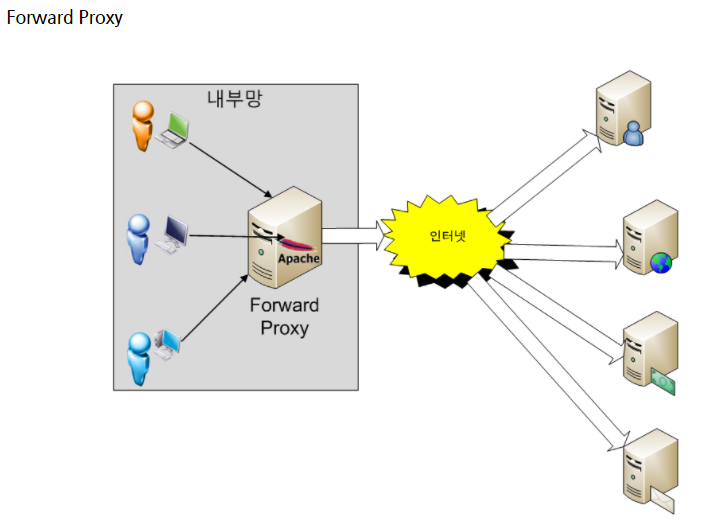
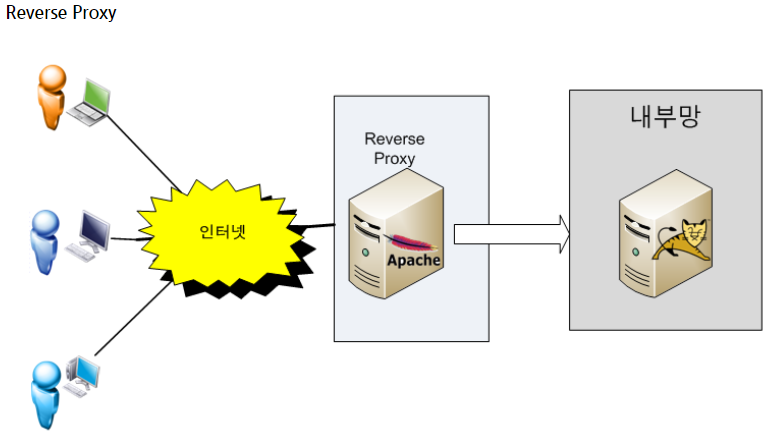

Kubernetes 정리 1
=====
K8S 사용하면서 에러 혹은 중요한 사항 정리용
-----
*****
### 서비스 정의
쿠버네티스의 서비스는 pod와 비슷한 REST 오브젝트. 모든 REST오브젝트와 마찬가지로,
서비스 정의를 API서버에 POST하여 인스턴스를 생성할 수 있음.  

예를 들어, 각각 TCP포트 9376에서 수신하고 `app=MyApp` 레이블을 가지고 있는 pod세트가 있다고 가정  
```
apiVersion: v1
kind: Service
metadata:
  name: my-service
spec:
  selector:
    app: MyApp
  ports:
    - protocol: TCP
      port: 80
      targetPort: 9376
```
이 yaml파일은 "my-service"라는 새로운 서비스 오브젝트를 생성하고, `app=MyApp` 레이블을 가진 pod의 TCP9376 포트를 대상으로 함
쿠버네티스는 이 서비스에 서비스 프록시가 사용하는 IP 주소("cluster IP"라고 불리는 것)를 할당.  
서비스의 기본 프로토콜은 TCP. 다른 프로토콜을 사용할 수도 있음.

####지원 프로토콜
> **TCP**: 모든 종류의 서비스에 TCP 사용가능. 기본 네트워크 프로토콜    
> **HTTP**: 클라우드 공급자가 이를 지원하는 경우, LoadBalancer 모드의 서비스를 사용하여 서비스의 엔드포인트로 전달하는 외부 HTTP/HTTPS
> 리버스 프록시 설정 가능.  
> **PROXY 프로토콜**: 클라우드 공급자가 지원하는 경우에, LoadBalancer 모드의 서비스를 사용, 쿠버 자체 외부에 로드 밸런서를 구성할 수 있으며, 
> 이때 접두사가 PROXY 프로토콜인 연결을 전달하게 됨  
> 
> 이 외에도 지원되는 프로토콜이 더 있음. 우선 중요해 보이는 것만 정리.

많은 서비스가 하나 이상의 포트를 노출해야 하기 때문에, 쿠버는 서비스 오브젝트에서 다중 포트 정의를 지원. 각 포트는 동일 혹은 다른 프로토콜로 정의될 수 있음.  

### 서비스 찾기
쿠버네티스는 서비스를 찾는 두 가지 기본 모드를 지원. 환경 변수와 DNS
#### 환경 변수
파드가 노드에서 실행될 때, kubelet은 각 활성화된 서비스에 대해 환경 변수 세트를 추가한다. 도커 링크 호환 변수와 보다 간단한 
`{SVCNAME}_SERVICE_HOST` 및 `{SVCNAME}_SERVICE_PORT` 변수를 지원하고, 이때 서비스 이름은 대문자이고 대시는 밑줄로 변환된다.

예를 들어, TCP 포트 6379를 개방하고 클러스터 IP 주소 10.0.0.11이 할당된 서비스 `redis-master`는, 다음 환경 변수를 생성한다.
```
REDIS_MASTER_SERVICE_HOST=10.0.0.11
REDIS_MASTER_SERVICE_PORT=6379
REDIS_MASTER_PORT=tcp://10.0.0.11:6379
REDIS_MASTER_PORT_6379_TCP=tcp://10.0.0.11:6379
REDIS_MASTER_PORT_6379_TCP_PROTO=tcp
REDIS_MASTER_PORT_6379_TCP_PORT=6379
REDIS_MASTER_PORT_6379_TCP_ADDR=10.0.0.11
```
> **참고:**  
> 서비스에 접근이 필요한 pod가 있고, 환경 변수를 사용해 포트 및 클러스터 IP를 클라이언트 pod에 부여하는 경우, 클라이언트 파드가 
> 생성되기 **_전에_** 서비스를 만들어야 한다. 그렇지 않으면, 해당 클라이언트 pod는 환경 변수를 생성할 수 없다.

#### DNS
애드온을 사용하여 쿠버네티스 클러스터의 DNS 서비스를 설정할 수(대개는 필수적임)있다.

CoreDNS와 같은, 클러스터-인식 DNS 서버는 새로운 서비스를 위해 쿠버네티스 API를 감시하고 각각에 대한 DNS 레코드 세트를 생성한다.
클러스터 전체에서 DNS가 활성화된 경우 모든 파드는 DNS 이름으로 서비스를 자동으로 확인할 수 있어야 함.  
예를 들어, 쿠버네티스 네임스페이스 `my-ns`에 `my-service`라는 서비스가 있는 경우, 컨트롤 플레인과 DNS 서비스가 함께 작동하여 
`my-service.my-ns`에 대한 DNS레코드를 만든다. `my-ns` 네임스페이스 pod들은 `my-service`(`my-service.my-ns` 역시 동작함)에 대한
이름 조회를 수행하여 서비스를 찾을 수 있어야 한다. 

다른 네임스페이스의 pod들에서 `my-ns`를 조회하려면 `my-service.my-ns`로 사용해야 함. 이 이름은 서비스에 할당된 클러스터 ip로 변환됨.

### 서비스 퍼블리싱(Sevice Types)
애플리케이션 중 일부(예: 프론트엔드)는 서비스를 클러스터 밖에 위치한 외부 ip주소에 노출하고 싶은 경우가 있음.
쿠버네티스 `ServiceTypes`는 원하는 서비스 종류를 지정할 수 있게 해줌. 디폴트는 `ClusterIP`.
`Type`값과 그 동작은 다음과 같다.

> * `ClusterIP`: 서비스를 클러스터-내부 IP에 노출시킨다. 이 값을 선택하면 클러스터 내에서만 서비스에 도달할 수 있다. 
               이것은 ServiceTypes의 기본 값이다.
> * `NodePort`: 고정 포트 (`NodePort`)로 각 노드의 IP에 서비스를 노출시킨다. `NodePort` 서비스가 라우팅되는 `ClusterIP` 서비스가 자동으로 
              생성된다. `<NodeIP>:<NodePort>`를 요청하여, 클러스터 외부에서 `NodePort` 서비스에 접속할 수 있다.
> * `LoadBalancer`: 클라우드 공급자의 로드 밸런서를 사용하여 서비스를 외부에 노출시킨다. 
                  외부 로드 밸런서가 라우팅되는 `NodePort`와 `ClusterIP` 서비스가 자동으로 생성된다.
> * `ExternalName`: 값과 함께 CNAME 레코드를 리턴하여, 서비스를 `externalName` 필드의 콘텐츠 (예:`foo.bar.example.com`)에 매핑한다. 
                  어떤 종류의 프록시도 설정되어 있지 않다.

#### NodePort 유형
`type`필드를 `NodePort`로 설정하면, 쿠버네티스 컨트롤 플레인은 `--serivce-node-port-range`플래그로 지정된 범위에서 포트를 할당함
(기본값: 30000-32767). 각 노드는 해당 포트(모든 노드에서 동일한 포트번호)를 서비스로 프록시한다.  
> 프록시(Proxy)란?: 클라이언트가 자신(proxy)을 통해서 다른 네트워크 서비스에 간접적으로 접속할 수 잇게 해주는 컴퓨터 시스템이나 응용프로그램을 말함
>                  즉, 클라이언트와 서버 사이에 존재하며 대리로 통신을 수행하는것을 의미.  
>   
> 프록시의 사용 이유
> 1. 익명으로 컴퓨터를 유지(주로 보안을 위함)
> 2. 캐시를 사용하여 접근을 빠르게 하기 위함
> 3. 보안 및 통제를 뚫고 나가기 위함
> 4. 바이러스 전파, 악성 루머 전파, 다른 정보를 빼낼 목적
> 5. 역으로 IP추적을 당하지 않을 목적
> 6. 지역 제한을 우회하기 위함  
> etc.  
>   
> **foward proxy**  
> 
>   
> 
> 포워드 프록시는 흔히 사람들이 사용하는 프록시  
> 클라이언트가 한 웹사이트 'A'에 접속을 요청할 때 직접 연결을 시도하지 않고 포워드 프록시 서버가 받아서 대신 인터넷을 거쳐 A사이트로 보내고
> 그에 대한 응답을 클라이언트에 전달. 대개 캐시 저장 기능이 있으므로 자주 접속하는 사이트라면 더욱 빠른 속도로 이용할 수 있고, 웹 사용 환경을 
> 제한할 수 있으므로 기업 환경 등에서 많이 사용  
>   
> **reverse proxy**  
> 
>   
> 
> 사용자가 보낸 패킷이 인터넷 세계를 거쳐 리버스 프록시에 도착. 문지기같은 역할을 함. 요청을 받은 문지기는 내부 서버와 통신을 해 데이터를 전달하고
> 응답을 받으면 클라이언트에 전송. 이와 같이 구성하면 내부 서버의 보안성을 높일 수 있음. 그래서 보통 기업의 네트워크 환경은 리버스 프록시 서버를 
> 두고 실제 서비스 서버는 내부망에 위치 시킨 후 프록시 서버만 내부에 있는 서비스 서버와 통신을 하여 제공하는 방식으로 서비스.  
>   
> 특히 리눅스 환경이라면 리버스 프록시로 아파치 웹 서버를 사용한다면 SELinux를 켜놓을 경우 기본 정책이 웹 서버는 톰캣의 8080, 8009 포트만 접근할 수
> 있으므로 아파치 웹 서버가 해킹당해도 웹 서버 권한으로는 내부망 연결이 불가능하게 됨  
>   
>   
> ###**쿠버 설치 시 변경해야 하는 옵션들**  
> **SELinux**
>   
> SELinux는 enforce, permissive, disable 세 가지 모드로 동작하고 기본적으로 enforce모드로 동작한다.  
> 쿠버네티스 클러스터에서는 SELinux를 permissive 모드로 설정해주어야 하는데 쿠버의 pod네트워크에 필요한 호스트 파일시스템에 접근하기 위해서이다.
> ```
> setenforce 0
>
> sed -i 's/^SELINUX=enforcing$/SELINUX=permissive/' /etc/selinux/config
> 
> sestatus
> ```
>   
> **방화벽 해제**  
>   
> 방화벽을 비활성화 하는 이유는 쿠버를 운영하기 위한 필수 포트가 열려있어야 하는데 쿠버를 빠르게 설치하고 테스트하기 위한 
> 쿠버네티스 클러스터를 구축하기 위해서 방화벽을 비활성화 시켜줌. 아마 방화벽이 활성화 되어 있으면 클러스터 구축시 건드려야 할 옵션이 많아서 그런거 아닐까...
>   
> ```
> systemctl stop firewalld && systemctl disable firewalld
> systemctl stop NetworkManager && systemctl disable NetworkManager
> ```
> **iptables 커널 옵션 활성화**  
>   
> iptables는 리눅스에서 방화벽 설정을 도와주는 도구
> iptables는 커널상에서 netfilter 패킷필터링 기능을 사용자 공간에서 제어하는 수준으로 사용할 수 있다고 한다.
> CentOS 7 에서는 `net.bridge.bridge-nf-call-iptables` 값이 기본값이 0으로 되어있다.
> 0으로 되어있다는 것은 bridge 네트워크를 통해 송수신되는 패킷들이 iptables 의 설정을 우회한다고 한다.
> 그래서 사용할 때 iptables가 무시되어 트래픽이 잘못 라우팅되는 문제가 발생한다고 한다.
> 따라서, iptables 가 브리지된 네트워크 트래픽을 제대로 보기 위해서는 `net.bridge.bridge-nf-call-iptables` 값이 1으로 되어야 함.
>   
> ```
> lsmod | grep br_netfilter
> sudo modprobe br_netfilter
> cat <<EOF >  /etc/sysctl.d/k8s.conf
> net.bridge.bridge-nf-call-ip6tables = 1
> net.bridge.bridge-nf-call-iptables = 1
> EOF
> sysctl --system
> ```
> **swap 메모리 비활성화**
>   
> 네트워크 부분과 어울리지 않지만 그냥 여기다 적음.  
> 쿠버네티스는 pod를 생성할 때, 필요한 만큼의 리소스를 할당 받아서 사용하는 구조. 따라서 메모리 swap을 고려하지 않고 설계되었기 때문에, 
> 쿠버네티스 클러스터 Node들은 모두 swap 메모리를 비활성화 해주어야 함
> ```
> swapoff -a && sed -i '/ swap / s/^/#/' /etc/fstab
> ```
 

서비스는 할당된 포트를 `.spec.ports[*].nodePort`필드에 나타냄. 포트를 프록시하기 위해 특정 IP를 지정하려면, kube-proxy에 대한 
`--nodeport-addresses`플래그 또는 kube-proxy 구성 파일의 동등한 `nodePortAddresses` 필드를 특정 IP블록으로 설정 가능.

사용자가 특정 포트 번호를 원한다면, `nodePort`필드에 값을 지정할 수 있다. 컨트롤 플레인은 해당 포트를 할당하거나 API트랜잭션이 
실패했다고 보고함. 이는 사용자 스스로 포트 충돌의 가능성을 체크해야 한다는 의미. 또한 NodePort 사용을 위해 구성된 범위 내에 있는
유효한 포트 번호를 사용해야 한다.

#### 로드밸런서 유형
외부 로드 밸런서를 지원하는 클라우드 공급자 상에서, `type` 필드를 `LoadBalancer`로 설정하면 서비스에 대한 로드 밸런서를 프로비저닝 함.
로드 밸런서의 실제 생성은 비동기적으로 수행되고, 프로비저닝 된 밸런서에 대한 정보는 서비스의 `.status.loadBalancer` 필드에 표시됨.


