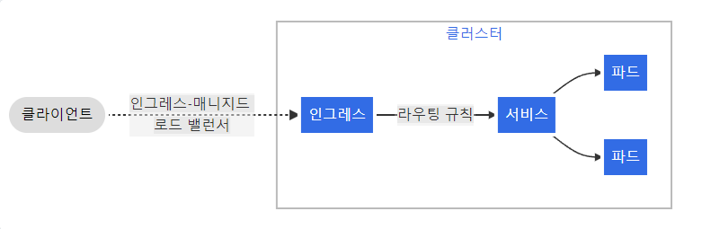

Kubernetes 정리 2
=====
K8S 사용하면서 에러 혹은 중요한 사항 정리용
-----
*****
## Ingress(인그레스)

네트워크 트래픽은 Ingress와 egress로 구분. egress는 외부로 나가는 것, Ingress는 외부에서 내부로 들어오는 네트워크 트래픽.  
  
쿠버네티스에도 `Ingress`라고 하는 오브젝트가 존재. 쿠버네티스의 Ingress는 외부에서 쿠버 클러스터 내부로 들어오는 네트워크 요청:
즉, Ingress 트래픽을 어떻게 처리할 지 정의함. 쿠버에서 실행중인 deployment나 service에 접근하기 위한 관문 같은 역할을 담당.  

다음은 ingress가 모든 트래픽을 하나의 서비스로 보내는 간단한 예시이다.
  

서비스를 외부로 노출시켜 제공해야 한다면 Ingress를 사용하는 것이 바람직함. Ingress 요청을 처리하기 위한 service는 일반적으로 
클라우드 플랫폼에서 제공되는 `LoadBalancer` 타입의 service를 사용함. private cloud환경에서 운영하는 서버에 ingress를 직접 구축한다면
service의 type을 `NodePort`, 또는 `ExternalIP`, `MetalLB`등을 대신 사용할 수 있음.

### 전제 조건들
인그레스 컨트롤러가 있어야 인그레스 설정 가능. 인그레스 리소스만 생성한다면 효과가 없다. `ingress-nginx`와 같은 인그레스 컨트롤러를 
배포해야 할 수도 있다.

### 인그레스 컨트롤러
인그레스 리소스가 작동하려면, 클러스터는 실행 중인 인그레스 컨트롤러가 반드시 필요. `kube-controller-manager` 바이너리 일부로 실행되는
컨트롤러의 다른 타입과 달리 인그레스 컨트롤러는 클러스터와 함께 자동으로 실행 X. 클러스터에 가장 적합한 인그레스 컨트롤러를 선택해야 함
하나의 클러스터 내에 여러 개의 인그레스 컨트롤러를 배포할 수 있다. 인그레스를 생성할 때, 클러스터 내에 둘 이상의 인그레스 컨트롤러가 존재하는 경우
어떤 인그레스 컨트롤러를 사용해야 하는지 명시해 주어야 함. `ingress.class` 어노테이션을 각각의 인그레스에 추가해야 함.  
만약 클래스를 정의하지 않으면, 클라우드 제공자는 기본 인그레스 컨트롤러를 사용할 수 있다.
https://kubernetes.io/ko/docs/concepts/services-networking/ingress-controllers/ 참조

### 인그레스  
```
최소한의 인그레스 리소스 예제:

apiVersion: networking.k8s.io/v1
kind: Ingress
metadata:
  name: minimal-ingress
  annotations:
    nginx.ingress.kubernetes.io/rewrite-target: /
spec:
  rules:
  - http:
      paths:
      - path: /testpath
        pathType: Prefix
        backend:
          service:
            name: test
            port:
              number: 80
```
다른 모든 쿠버네티스 리소스와 마찬가지로 인그레스에는 `apiVersion`, `kind` 그리고 `metadata`필드가 필요함. 인그레스 오브젝트의 이름은
유효한 DNS 서브도메인 이름이어야 함. 

### 인그레스 규칙  
각 HTTP 규칙에는 다음의 정보가 포함된다.  

* 선택적 호스트. 이 예시에서는 호스트가 지정되지 않기에 지정된 ip주소를 통해 모든 인바운드 HTTP트래픽에 규칙이 적용된다. 만약 호스트가 
  제공되면(foo.bar.com), 규칙이 해당 호스트에 적용된다.  
* 경로 목록(/testpath)에는 각각 `service.name`과 `service.port.name` 또는 `service.port.number`가 정의되어 있는 관련 백엔드를 
  가지고 있다. 로드 밸런서가 트래픽을 참조된 서비스로 보내기 전에 호스트와 경로가 모두 수신 요청의 내용과 일치해야 한다.
* 백엔드는 서비스와 포트 이름의 조합이다. 호스트와 규칙 경로가 일치하는 인그레스에 대한 HTTP(와 HTTPS)요척은 백엔드 목록으로 전송된다.

### DefaultBackend

규칙이 없는 인그레스는 모든 트래픽을 단일 기본 백엔드로 전송한다. `defaultBackend` 는 일반적으로 인그레스 컨트롤러의 구성 옵션이며, 인그레스 리소스에 
지정되어 있지 않다.  
만약 인그레스 오브젝트의 HTTP요청과 일치하는 호스트 또는 경로가 없으면, 트래픽은 기본 백엔드로 라우팅 된다.

### 리소스 백엔드

`Resource` 백엔드는 인그레스 오브젝트와 동일한 네임스페이스 내에 있는 다른 쿠버네티스 리소스에 대한 ObjectRef이다. `Resource` 는 서비스와 
상호 배타적인 설정이며, **둘 다 지정하면 유효성 검사에서 실패한다.** `Resource` 백엔드의 일반적인 용도는 정적 자산이 있는 오브젝트 스토리지
백엔드로 데이터를 수신하는 것이다.

```
apiVersion: networking.k8s.io/v1
kind: Ingress
metadata:
  name: ingress-resource-backend
spec:
  defaultBackend:
    resource:
      apiGroup: k8s.example.com
      kind: StorageBucket
      name: static-assets
  rules:
    - http:
        paths:
          - path: /icons
            pathType: ImplementationSpecific
            backend:
              resource:
                apiGroup: k8s.example.com
                kind: StorageBucket
                name: icon-assets
```
위의 인그레스를 생성한 후, 다음의 명령으로 확인할 수 있다.

`kubectl descibe ingress ingress-resource-backend`

```
Name:             ingress-resource-backend
Namespace:        default
Address:
Default backend:  APIGroup: k8s.example.com, Kind: StorageBucket, Name: static-assets
Rules:
  Host        Path  Backends
  ----        ----  --------
  *
              /icons   APIGroup: k8s.example.com, Kind: StorageBucket, Name: icon-assets
Annotations:  <none>
Events:       <none>
```

### 경로 유형

인그레스의 각 경로에는 해당 경로 유형이 있어야 한다. **명시적 `pathType`을 포함하지 않는 경로는 유효성 검사에 실패한다.** 지원되는 경로 유형은
세 가지.  

* `ImplementationSpecific`: 이 경로 유형의 일치 여부는 인그레스 클래스에 따라 달라짐. 이를 구현할 때 별도 `pathType`으로 처리하거나, 
  `prefix` 또는 `Exact` 경로 유형과 같이 동일하게 처리할 수 있다.
* `Exact`: URL 경로의 대소문자를 엄격하게 일치시킨다.
* `Prefix`: URL 경로의 접두사를 `/`를 기준으로 분리한 값과 일치시킨다. 일치는 대소문자를 구분하고, 요소별로 경로 요수에 대해 수행한다.
  모든 *p*가 요청 경로의 요소별 접두사가 *p* 인 경우 요청은 _p_ 경로에 일치한다.

|종류|경로|요청 경로|일치 여부|  
|------|---|---|---|
|Prefix|/|(모든 경로)|예|
|Exact|/foo|/foo|예|
|Exact|/foo|/bar|아니오|
|Exact|	/foo|	/foo/|	아니오|
|Exact|	/foo/|	/foo|	아니오|
|Prefix|	/foo|	/foo, /foo/|	예|
|Prefix|	/foo/|	/foo, /foo/|	예|
|Prefix|	/aaa/bb|	/aaa/bbb|	아니오|
|Prefix|	/aaa/bbb|	/aaa/bbb|	예|
|Prefix|	/aaa/bbb/|	/aaa/bbb|	예, 마지막 슬래시 무시함|
|Prefix|	/aaa/bbb|	/aaa/bbb/|	예, 마지막 슬래시 일치함|
|Prefix|	/aaa/bbb|	/aaa/bbb/ccc|	예, 하위 경로 일치함|
|Prefix|	/aaa/bbb|	/aaa/bbbxyz|	아니오, 문자열 접두사 일치하지 않음|
|Prefix|	/, /aaa|	/aaa/ccc|	예, /aaa 접두사 일치함|
|Prefix|	/, /aaa, /aaa/bbb|	/aaa/bbb|	예, /aaa/bbb 접두사 일치함|
|Prefix|	/, /aaa, /aaa/bbb|	/ccc|	예, / 접두사 일치함|
|Prefix|    /aaa|	/ccc|	아니오, 기본 백엔드 사용함|
|Mixed|	/foo (Prefix), /foo (Exact)|	/foo|	예, Exact 선호함|

#### 다중 일치
경우에 따라 인그레스의 여러 경로가 요청과 일치할 수 있다. 이 경우 가장 긴 일치하는 경로가 우선하게 된다. 두 개의 경로가 여전히 동일하게 일치하는 
경우 접두사 경로 유형보다 정확한 경로 유형을 가진 경로가 사용 된다.

### 호스트네임 와일드카드
호스트는 정확한 일치(`foo.bar.com`) 또는 와일드카드(`*.foo.com`) 일 수 있다. 정확한 일치를 위해서는 HTTP `host`헤더가 `host` 필드와 일치해야
한다. 와일드카드 일치를 위해서는 HTTP `host`헤더가 와일드카드 규칙의 접미사와 동일해야 한다.

|호스트|호스트헤더|일치여부|
|---|---|---|
|*.foo.com|	bar.foo.com|	공유 접미사를 기반으로 일치함|
|*.foo.com|	baz.bar.foo.com|	일치하지 않음, 와일드카드는 단일 DNS 레이블만 포함함|
|*.foo.com|	foo.com|	일치하지 않음, 와일드카드는 단일 DNS 레이블만 포함함|
```
apiVersion: networking.k8s.io/v1
kind: Ingress
metadata:
  name: ingress-wildcard-host
spec:
  rules:
  - host: "foo.bar.com"
    http:
      paths:
      - pathType: Prefix
        path: "/bar"
        backend:
          service:
            name: service1
            port:
              number: 80
  - host: "*.foo.com"
    http:
      paths:
      - pathType: Prefix
        path: "/foo"
        backend:
          service:
            name: service2
            port:
              number: 80
```


