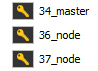
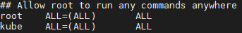
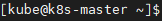
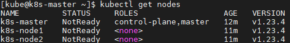
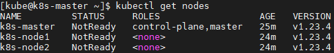
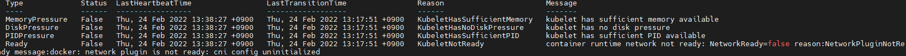
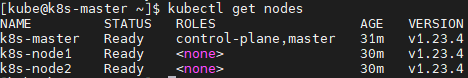

Kubernetes 설치
=====
K8S 사용하면서 에러 혹은 중요한 사항 정리용
-----
*****
## 1. 클러스터 구성
  
### 1.1 서버명 변경 및 k8s 관리 유저 생성
한 눈에 역할을 알아보기 쉽도록 마스터 노드는 k8s-master, 워커 노드는 k8s-node1(36), k8s_node2(37)로 서버명 변경 및 k8s 관리를 위한 유저 생성
유저명은 '`kube`' 로 통일하였음
  
root 계정으로 visudo 입력 후 아래 이미지처럼 생성한 유저 추가(생성한 유저에 root권한 부여)  
  
쿠버네티스 관리를 편리하게 하기 위함.

완료되면 커맨드창이 아래와 같은 형태로 변함.  
  

### 1.2 쿠버네티스 설치 준비
(모두 root 계정으로 실행)
#### docker 설치 및 활성화

```
# curl -s https://get.docker.com | sudo sh

# systemctl enable --now docker
```

#### SELINUX 비활성화

```
# setenforce 0

# sed -i 's/^SELINUX=enforcing$/SELINUX=disabled/' /etc/selinux/config
```

#### SWAP 비활성화

```
# swapoff -a

# sed -i '/ swap / s/^\(.*\)$/#\1/g' /etc/fstab
```

#### 방화벽 끄기

```
# systemctl disable firewalld

# systemctl stop firewalld
```

#### IPTABLES 설정

```
# cat <<EOF | sudo tee /etc/modules-load.d/k8s.conf
br_netfilter
EOF
```
```
# cat <<EOF | sudo tee /etc/sysctl.d/k8s.conf
net.bridge.bridge-nf-call-ip6tables = 1
net.bridge.bridge-nf-call-iptables = 1
EOF
```
```
sysctl --system
```

#### host(/etc/hosts)파일 편집

```
# cat <<EOF >> /etc/hosts
{master_ip} k8s-master
{node1_ip} k8s-node1
{node2_ip} k8s-node2
EOF
```

### 쿠버네티스 설치
#### kubernetes.repo 등록
```
# cat <<EOF | sudo tee /etc/yum.repos.d/kubernetes.repo
[kubernetes]
name=Kubernetes
baseurl=https://packages.cloud.google.com/yum/repos/kubernetes-el7-\$basearch
enabled=1
gpgcheck=1
repo_gpgcheck=1
gpgkey=https://packages.cloud.google.com/yum/doc/yum-key.gpg https://packages.cloud.google.com/yum/doc/rpm-package-key.gpg
exclude=kubelet kubeadm kubectl
EOF
```

#### kubeadm, kubelet, kubectl 패키지 설치
```
# yum install -y kubelet kubeadm kubectl --disableexcludes=kubernetes
# systemctl enable --now kubelet
```  
설치 버전 확인
```
# kubeadm version -o short

# kubectl version --short

# kubelet --version
```  
daemon.json 편집
```
# cat <<EOF | sudo tee /etc/docker/daemon.json
{
  "exec-opts": ["native.cgroupdriver=systemd"],
  "log-driver": "json-file",
  "log-opts": {
    "max-size": "100m"
  },
  "storage-driver": "overlay2",
  "storage-opts": [
    "overlay2.override_kernel_check=true"
  ]
}
EOF
```  
편집 후   
```
 sudo systemctl daemon-reload
 sudo systemctl restart docker
 sudo systemctl restart kubelet
```
control-plane node(master node)
```
$ kubeadm init --apiserver-advertise-address {k8s-master IP} --pod-network-cidr=172.31.0.0/16
```  
> init 이나 join을 할 때  
> The connection to the server localhost:8080 was refused - did you specify the right host or port?  
> 이런 에러가 뜰 수 있음. 이는 쿠버네티스 컨피그 파일이 $HOME/.kube 디렉토리 밑에 없거나 현재 유저정보가 컨피그 파일에 반영되지 않은 경우에 발생
> 1. 마스터 노드에서 에러가 발생한 경우:  
> /etc/kubernetes/admin.conf 파일을 $HOME/.kube/config로 복사 후 소유자 변경을 해준다.
> ```
> $ mkdir -p $HOME/.kube
> $ sudo cp -i /etc/kubernetes/admin.conf $HOME/.kube/config
> $ sudo chown $(id -u):$(id -g) $HOME/.kube/config
> ```  
> root 사용자에서:  
> ```KUBECONFIG=/etc/kubernetes/admin.conf``` 실행  
> 
> 2. 마스터 노드가 아닌 곳에서 에러가 발생한 경우:  
> 마스터노드(서버)에 생성된 $HOME/.kube/config 파일을 접근을 시도하는 서버의 $HOME/.kube 디렉토리로 가져온 후,
> chwon 명령어를 통해 소유자를 변경해준다(`sudo chown ~`)
> 
> * aws eks로 구축한 곳에서는 해결방법이 다름
> 
worker node(k8s-node1, k8s-node2)
```
$ kubeadm join 192.168.0.101:6443 --{token made by master}
```
> etc/kubernetes/admin.conf 파일은 쿠버 마스터에만 존재함(kubeadm init시에 생성). 따라서 master노드에서만 kubectl 명령어
> 사용 가능.  

**_노드가 클러스터에 참여하였는지 확인_**
  

> 노드의 status가 계속 NotReady 인 상황
>  
> `kubectl describe nodes`로 오류 체크 후 처리 필요  
>
> 오류 예제1)  
>   
> `kubectl apply -f https://raw.githubusercontent.com/coreos/flannel/master/Documentation/kube-flannel.yml`  
> 명령어 실행 후  
> `systemctl restart kubelet`  
> `kubectl get nodes`  
> 명령어 차례로 실행

**_노드들 클러스터 참여 확인_**
  

#### 노드 라벨 설정
`$ kubectl label node k8s-node1 node-role.kubernetes.io/worker=worker`  
`$ kubectl label node k8s-node2 node-role.kubernetes.io/worker=worker`


