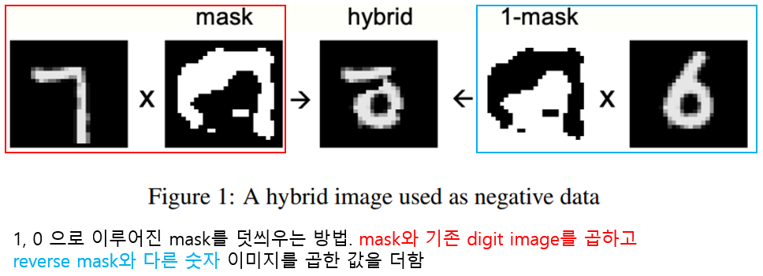

The Forward-Forward Algorithm
=============

## abstract
기존 방식은 forward-backward 방식. 오류를 역전파(backpropagation) 함으로써 가중치들을 업데이트 함. 본 연구에선 Forward-Forward(FF) 
방식을 제안. 2 way forward pass(positive, negative dataset. 네트워크에서 생성됨) 로 forward-backward 효과를 낼 것임.  

각 네트워크 레이어는 목적함수를 가지고 있고 positive data에는 좋은 점수, negative data에는 낮은 점수를 그 목표로 함. 
positive way 와 negative way 가 분리될 수 있다면 negative way 는 오프라인으로 할 수 있고, 미분하느라(backpropagation) 
시간을 허비하지 않을 수 있음(빠름) <br>

<br>

##1. Backpropagation의 문제점
* Stochastic gradient descent는 딥러닝의 성공에 많은 영향을 끼침
* time sequence 방식이든, 이미지든 역전파는 실제 뉴런이 배우는 방식과는 다름(뉴런이 backward pass를 사용한다고 할 수 없음)
* top-down 방식(backpropagation)은 이후 레이어가 이전 레이어에 영향을 미치지만, 실제 인간의 지각능력은 실시간으로 작동함
* 역전파의 큰 문제점은 올바른 미분값을 구하기 위해선 forward pass에서의 계산 방법을 완벽히 알아야 한다는 점임.
  블랙 박스를 input으로 할 때 블랙 박스가 어떤식으로 forward pass 되는 지 모른다면 역전파도 할 수 없음.
* 완벽한 forward pass 모델이 존재하지 않기 때문에 강화학습(reinforcement learning 이라고 나왔지만 딥러닝 기법 중 '강화 학습' 
  을 의미하는 것은 아닌듯. 다음 문단을 읽어보면 '계산방식을 알고 있는' 다양한 딥러닝 기법을 의미하는 듯)시 매번 다른 모델이 
  선택됨(수많은 매개변수의 섭동 때문).하지만 이러한 상황을 average하기 위해선 learning rate 가 parameter 수에 반비례 해야 
  하는데(작은 learning rate) 이렇게 되면 학습 시 비용이 커짐. 이러한 이유로 거대한 모델에선 Backpropagation과 비교할 순 없음. 
* 이번 연구의 요점은 비선형성을 포함한 인공신경망 모델들이 이런 기법들에 의지하지 않아도 된다는 것. FF 방식은 Backpropagation보다 
  속도면에서는 비슷하지만 모델의 정확한 계산방식(e.g. RNN, CNN 이 forward시 계산 방식이 다름)을 몰라도 작동한다는 데에 있음.
* 논문에서 테스트한 바에 의하면 FF방식이 역전파보다 항상 빠른 것이 아님. 매우 큰 데이터셋으로 학습된 매우 큰 모델들은 계속 역전파를 
  사용할 것으로 보임. 
* 하지만 FF방식은 두가지 측면에서 장점을 보일 것 같은데 model이 cortex상에서 학습되는 경우, low power hardware에서 학습되는 경우.

##2. Forward-Forward 알고리즘
FF 알고리즘은 [볼츠만 머신](https://idplab-konkuk.tistory.com/14) 과 [Noise Contrastive Estimation](https://nuguziii.github.io/survey/S-006/) 
에 영감을 받아 탄생한 탐욕적 멀티 레이어 절차(greedy multi-layer procedure). 
forward-backward 방식을 대체하기 위해 제안되었으며 두 개의 forward(positive, negative pass)는 같은 방향으로, 다른 데이터를 가지고, 
다른 목적을 위해 forward pass 됨.
positive 는 real data 를 이용하여 각 레이어의 weight 를 모델 성능(goodness)을 올리기 위해 pass 되고 negative 는 "negative data"를 
이용하여 각 히든 레이어의 성능을 
낮추기 위해 pass 됨. 본 논문에선 두가지 성능측정 방법을 살펴봄.   
```
1. sum of squared neural activities
2. negative sum of squared neural activities.
```
logistic function 이 적용된 input vector 가 positive 일 떄, 이 값이 positive 인지 negative 인지 잘 분류하는 것이 목적임.   
.png)  
싱글 hidden layer 에서 해당식의 결과가 높으면 positive, 낮으면 negative 하게 함. hidden layer 가 두개 이상일 때, 두번째 히든레이어에 
들어가는 input 이 단순 첫번째 hidden layer 의 아웃풋(length of activity vector in first hidden layer)일 경우 두번째 
히든 레이어의 작업은 의미가 없음(같은 행동(같은 벡터, 같은 활성화 함수)을 하는 것이기 때문이라고 생각. 같은 정보 사용). 
이를 해결하기 인풋 벡터들을 다 normalize 해줌 (Ba et al., 2016b; Carandini and Heeger, 2013) . 
이 행동은 first hidden layer에서 goodness 정보를 얻기 위한 작업에서 사용된 information 들과는 다른 정보들을 이용, goodness를 판단하는 역할을 할 듯.
다시 말하면, 첫번째 first hidden layer 에선 activity vector 의 길이와 방향이 goodness 를 판단하는데 사용되고 다음 레이어 부턴
방향만이 그 역할을 함

##3. FF 알고리즘을 이용한 몇가지 시험
상대적으로 작은 네트워크(몇백만 정도의 연결)에서 유용하다는 것을 보일 것임. 큰 네트워크에서의 실험은 후속 논문에서.

###3.1 베이스라인(Backpropagation)
Backpropagation 사용시 MNIST 는 약 1.4% 의 테스트 에러를 가진다고 설정.  

###3.2 simple unsupervised example of FF 
FF 알고리즘이 해결해야 하는 두가지 질문이 있음.  
1. 좋은 negative data 가 있다면 모델이 특징을 잘 잡아 낼까?
2. negative data 는 어디서 오는가? 어디서 구할까?  
  
지도학습에서 [contrastive learning](https://daebaq27.tistory.com/97) 을 사용하는 방법은 첫째, input vector 를 라벨이나 기타 
정보 없이 representation vector 로 선형 변환하는 법을 학습함. 이렇게 변형된 vector 들을 이용해 logit vector 화 하는 방법을 학습함.
이 logit vector 는 softmax 를 이용, 라벨 별 확률 분포를 계산할 때 사용
이렇게 linear transformation 부터 logit 까지 학습하는 부분은 supervised 지만 hidden layer 를 사용하지 않고 따라서 backpropagation 도 
사용하지 않음. FF 알고리즘은 이러한 학습 방법을 이용, real data vector 를 positive example 에서, corrupted data vectors 를 negative example
에서 학습함. data를 오염(corrupt)시키기 위한 방안은 다양함.  
FF 알고리즘이 (특성화 된)이미지 상의 longer range correlation 에 집중하게 하기 위해서는 very different long range correlation 을 가지고
similar short range correlation 을 가진 이미지를 만들어야 함(corrupt image data).  
  

  
fully connected 에선 test error 1.37%, local receptive fields(without weight-sharing) 에선 1.16% 달성


