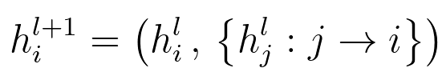
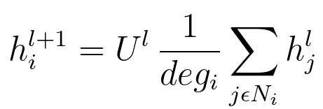

Graph Convolutional Network
=============

### 1. Knowledge Graphs as Multi-Relational Data
기본 graph structure 는 node 간의 연결이 undirected, no-typed, unique edges. 
예를 들어, 소크라테스와 플라톤을 각 node 로 기본 graph structure 에서 표현한다면 추가적인 정보가 표현되지 
않을 것.  
하지만 Knowledge Graph(KG) 형태로 표현한다면 플라톤이 소크라테스에 '영향을 받음', 소크라테스가 플라톤에 
'영향을 줌' 이라는 정보가 표현 가능하게 됨. node 간의 relationship 을 표현 가능하게 함.

### 2. GNN
node, Weight, adjacency matrix 설정
```python
import numpy as np

### one-hot vector representation of nodes (5, 5)
X = np.eye(5, 5)
n = X.shape[0]
np.random.shuffle(X)
# print(X)
[[0., 0., 1., 0., 0.]  # Node 1 
 [0., 1., 0., 0., 0.]  
 [0., 0., 0., 0., 1.]  
 [1., 0., 0., 0., 0.]
 [0., 0., 0., 1., 0.]] 

### Weight matrix(5, 3)
# Dimension of the hidden features
h = 3
# Random initialization with Glorot and Bengio
W = np.random.uniform(-np.sqrt(1./h), np.sqrt(1./h), (n, h))
# print(W)
[[-0.4294049,   0.57624235, -0.3047382 ]
 [-0.11941829, -0.12942953,  0.19600584]
 [ 0.5029172,   0.3998854,  -0.21561317]
 [ 0.02834577, -0.06529497, -0.31225734]
 [ 0.03973776,  0.47800217, -0.04941563]]

### Adjacency matrix of an undirect Graph (5, 5)
A = np.random.randint(2, size=(n, n))
# Include the self loop
np.fill_diagonal(A, 1)
# Symmetric adjacency matrix (undirected graph)
A_und = (A + A.T)
A_und[A_und > 1] = 1
# print(A_UND)
[[1, 1, 1, 0, 1] # Connections to Node 1
 [1, 1, 1, 1, 1] # Connections to Node 1
 [1, 1, 1, 1, 0] # Connections to Node 1
 [0, 1, 1, 1, 1]
 [1, 1, 0, 1, 1]] # Connections to Node 1

### Linear transformation
L_0 = X.dot(W)
# print(L_0)
[[ 0.5029172,   0.3998854,  -0.21561317]  # Node 1 (3rd row of W)
 [-0.11941829, -0.12942953,  0.19600584] 
 [ 0.03973776,  0.47800217, -0.04941563] 
 [-0.4294049,   0.57624235, -0.3047382 ]
 [ 0.02834577, -0.06529497, -0.31225734]]

### GNN - Neighborhood diffusion
ND_GNN = A_und.dot(L_0)
# print(ND_GNN)
[[ 0.45158244,  0.68316307, -0.3812803 ] # Updated Node 1
 [ 0.02217754,  1.25940542, -0.6860185 ]
 [-0.00616823,  1.3247004,  -0.37376116]
 [-0.48073966,  0.85952002, -0.47040533]
 [-0.01756022,  0.78140325, -0.63660287]]

### Test on the aggregation
assert(ND_GNN[0, 0] == L_0[0, 0] + L_0[1, 0] + L_0[2, 0] + L_0[4, 0])
```
이 단계의 작업을 식으로 나타내면 다음과 같다.  

  
h_i^(l+1)(기존 노드의 업데이트) 은 h_i^(l)(기존 노드) 와 h_j^(l)(이웃 노드들) 의 aggregation 으로 이루어짐

### 3. Graph Convolutional Networks(GCNs)
a.k.a Vanilla Graph Convolutional Networks.  
node 들의 feature vector 업데이트는 "isotropic averaging operation over the neighborhood features(이웃 node 의 
특징을 가중치 없이 평균. 모든 이웃 node 들이 평등하게 기여함)" 으로 진행됨. 이 계산은 기존 GNN 과 달리 추가적인 정보가 필요.
node 의 degree.

```python
### Degree vector(degree for each node)
import numpy as np

D = A_und.sum(axis=1)
# print(D)
[4, 5, 4, 4, 4]  # Degree of node 1

### Reciprocal of the degree(diagonal matrix)
D_rec = np.diag(np.reciprocal(D.astype(np.float32)))
# print(D_rec)
[[0.25, 0.,   0.,   0.,   0.  ] # Reciprocal value of Node 1 degree
 [0.,   0.2,  0.,   0.,   0.  ]
 [0.,   0.,   0.25, 0.,   0.  ]
 [0.,   0.,   0.,   0.25, 0.  ]
 [0.,   0.,   0.,   0.,   0.25]]

### GCN - Isotropic average computation
ND_GCN = D_rec.dot(ND_GNN)
# print(ND_GCN)
[[ 0.11289561,  0.17079077, -0.09532007] # Updated Node 1 (with deg)
 [ 0.00443551,  0.25188109, -0.1372037 ]
 [-0.00154206,  0.3311751,  -0.09344029]
 [-0.12018491,  0.21488001, -0.11760133]
 [-0.00439005,  0.19535081, -0.15915072]]

### Test on the isotropic average computation
assert(ND_GCN[0, 0] == ND_GNN[0, 0] * D_rec[0, 0])
```
1. (기존 node vector(5X5) * weight matrix(5X3) -> embedded matrix
2. U = Adjacency matrix * embedded matrix
3. Degree matrix(5X5, node 1개 별 degree matrix. 역수 취한 후 diagonal로 변환) * U -> node 별 update
  
이 Degree matrix 를 계산에 추가한 식은 다음과 같다.
  
업데이트 된 node 는(h_i^l+1) linear projection 결과(U^l) 와 해당 노드의 degree matrix(diag.)와 이웃 
노드들의 행렬곱 결과임.

### 4. Relational Graph Convolutional Networks(R-GCNs)
지금까지의 GCN 에선 undirected and no-typed graph 를 가정하였음.   
앞서 언급하였듯이, Vanilla GCN 의 node 업데이트 프로세스는 다음과 같음  
1. projection step(linear transform)은 기존 feature matrix와 weight matrix 의 행렬곱으로 진행 - 2D (n X h)
2. aggregation step 은 degree matrix(from adjacency matrix. diag, n X n) 와 1 단계의 output 의 행렬곱으로 진행 - 2D

Vanilla GCN -> KG structure 가 포함된 R-GCN 으로 개념을 확장하기 위해선 단순 degree matrix 외에도 edge 정보
(direction, type 등)가 필요함. 프로세스는 비슷하지만 약간 복잡. 프로세스는 다음과 같음  

#### (1) projection step ->
1. node initial feature. 기존 feature matrix - 2D
2. node hidden feature 가 describe 된 3D tensor(r, n, h). r 은 batch 인데 보통 생각하는 '그' batch 가 아닌
   relation type 배치임. degree matrix 가 type 별로 뭉쳐있다고 생각하면 될듯.

projection step 은 단순 weight matrix 와의 행렬곱이 아닌 상기된 batch 별 행렬곱으로 진행됨.

#### (2) aggregation step ->
1. 단순 연결 정보만을 가지고 있던 degree matrix 가 r-type 별 degree matrix 로 변환.
   즉, degree matrix 도 3D-tensor. 그리고 symmetric 했던 Vanilla 와 달리(diagonal) non symmetric 함  - (r, n, n)
2. 1 단계의 output * projection output 의 tensor 곱

```python
# print(X)
[[0., 0., 1., 0., 0.]  # Node 1 
 [0., 1., 0., 0., 0.]
 [0., 0., 0., 0., 1.]
 [1., 0., 0., 0., 0.]
 [0., 0., 0., 1., 0.]]

### Number of relation types (r)
num_rels = 2

### weight matrix of relation number 1 (n, h)
W_rel1 = np.rendom.uniform(-np.sqrt(1. / h), np.sqrt(1. / h), (n, h))
# print(W_rel1)
[[-0.46378913, -0.09109707, 0.52872529]
 [0.03829597, 0.22156061, -0.2130242]
 [0.21535272, 0.38639244, -0.55623279]
 [0.28884178, 0.56448816, 0.28655701]
 [-0.25352144, 0.334031, -0.45815514]]

### weight matrix of relation number 2 (n, h)
## random initialization with uniform distribution
W_rel2 = np.random.uniform(1 / 100, 0.5, (n, h))
# print(W_rel2)
[[0.22946783, 0.4552118, 0.15387093]
 [0.15100992, 0.073714, 0.01948981]
 [0.34262941, 0.11369778, 0.14011786]
 [0.25087085, 0.03614765, 0.29131763]
 [0.081897, 0.29875971, 0.3528816]]

### tensor including both weight matrices (r, n, h)
W_rels = np.concatenate((W_rel1, W_rel2))
W_rels = np.reshape(W_rels, (num_rels, n, h))
# print(W_rels)
[[[-0.46378913, -0.09109707, 0.52872529]
 [0.03829597, 0.22156061, -0.2130242]
 [0.21535272, 0.38639244, -0.55623279]
 [0.28884178, 0.56448816, 0.28655701]
 [-0.25352144, 0.334031, -0.45815514]],
 [[0.22946783, 0.4552118, 0.15387093]
 [0.15100992, 0.073714, 0.01948981]
 [0.34262941, 0.11369778, 0.14011786]
 [0.25087085, 0.03614765, 0.29131763]
 [0.081897, 0.29875971, 0.3528816]]]

### Linear transformation with batch matrix multiplication (r, n, h)
L_0_rels = np.matmul(X, W_rels)
# print(L_0_rels)

```


